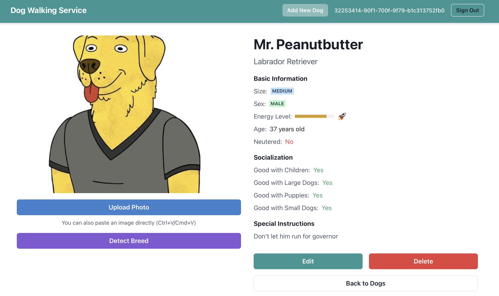

# Dog Walking Service Web Frontend

React site for the fictional [Dog Walking Service](https://github.com/rhargreaves/dog-walking).

> [!CAUTION]
> The code here has almost entirely been produced by AI :sparkles:. It is a quick-and-dirty UI which I am using to drive out new features for the [underlying API](https://github.com/rhargreaves/dog-walking) which I have taken more care on. Do not judge me on it! :smile:

## Screenshot



## Features

- View all registered dogs
- Register new dogs
- Update existing dog profiles
- Upload dog photos
- Automatic breed detection from photos

## Development Setup

### Prerequisites

- Node.js (v16 or newer)
- npm

### Build

1. Clone the repository
2. Install dependencies: `npm install`
3. Build: `make build`

### Running the Application

For local development, the application uses a fake backend server that includes both authentication and API endpoints:

```
make dev-server
```

This will start both:
- The React application on port 3001
- A local development server on port 3002 (for authentication and API)

### Authentication

- Local: You can log in with any username and password
- Production: AWS Cognito

### Environment Variables

Create a `.env` file using the [.example.env](.example.env) template.

## Deployment

This application is deployed to Cloudflare Pages.

```
make deploy
```

This will create a production build in the `build` directory.

### Routing

This app uses client-side routing. The `functions/_middleware.js` file is configured to handle SPA routing in Cloudflare Pages.

## License

GNU AGPL v3